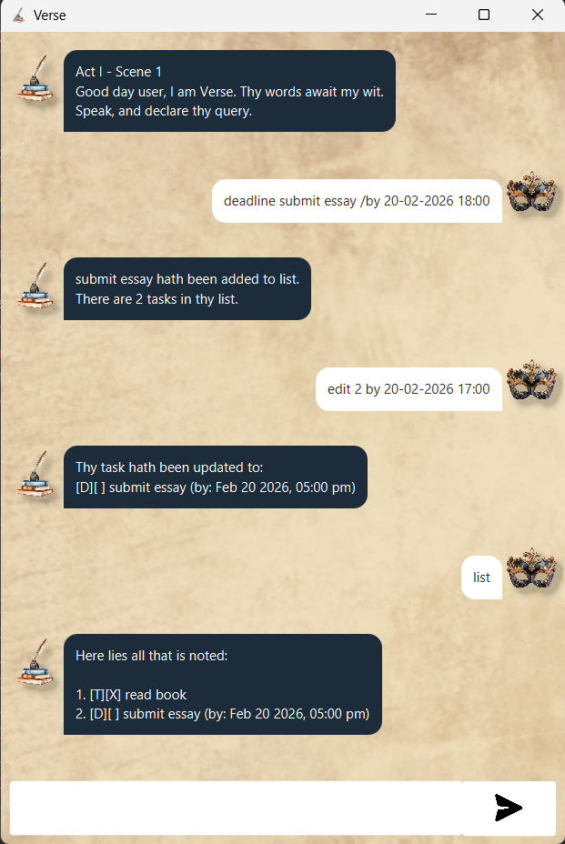
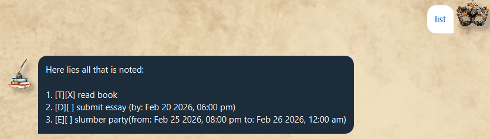
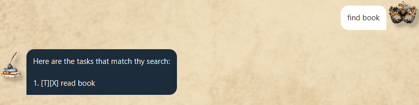

# Verse User Guide

## Introduction
Verse is a Shakespeare-inspired task management application that helps users organize and track tasks efficiently. It allows users to create different types of tasks, edit them, search through them, and manage their completion status.

Verse supports the following task types:

- To-do tasks
- Deadlines (tasks with a due date/time)
- Events (tasks with start and end times)

All interaction with Verse is done through typed commands.

## Command Summary

| Command   | Description |
|-----------|------------|
| `todo`    | Create a simple task |
| `deadline`| Create a task with a due date |
| `event`   | Create a task with start and end time |
| `list`    | Display all tasks |
| `mark`    | Mark a task as completed |
| `unmark`  | Mark a task as not completed |
| `delete`  | Remove a task |
| `find`    | Search tasks by keyword |
| `edit`    | Modify an existing task |
| `bye`     | Exit the application |

## Features
> [!NOTE]
> Words in `UPPER_CASE ` are the parameters to be supplied by the user.
e.g. in `todo DESC`, DESC is a parameter which can be used as `todo read book`

### 1. Todo
A to-do task is a simple task without any date or time.

**Format:** `todo DESC`

### 2. Deadline
A deadline task must be completed by a specified date or time.

**Format:** `deadline DESC  /by DATE/TIME`
> [!NOTE]
> The `DATE/TIME` must be in the format `DD-MM-YYYY HH:MM`.
> For example, `20-02-2026 23:59`.

### 3. Event
An event task has a start and end time.

**Format:** `event DESC  /from START_DATE/TIME /to END_DATE/TIME`
> [!NOTE]
> Both `START_DATE/TIME` and `END_DATE/TIME` must be in the format `DD-MM-YYYY HH:MM`.

### 4. List
Displays all tasks in the order they were added.

**Format:** `list`

**Example Output:**

### 5. Mark/Unmark
Marks a task as completed or not completed.

**Format:** `mark INDEX` or `unmark INDEX`
> [!NOTE]
> `INDEX` is the position of the task in the list (starting from 1).

### 6. Delete
Removes a task from the list.   

**Format:** `delete INDEX`  
> [!NOTE]
> `INDEX` is the position of the task in the list (starting from 1).

### 7. Find
Searches for tasks that contain a specific keyword in their description and prints the list.

**Format:** `find KEYWORD`
**Example Output:**

### 8. Edit
Modifies the description or date/time of an existing task using specific keywords.
#### 8.1 Todo
Keywords: 
- `desc` to edit the description 
  - **Format** :`edit INDEX desc NEW_DESC`

#### 8.2 Deadline
Keywords:
- `desc` to edit the description
  - **Format** :`edit INDEX desc NEW_DESC`
- `by` to edit the due date/time
  - **Format** :`edit INDEX by NEW_DATE/TIME`   

#### 8.3 Event
Keywords:
- `desc` to edit the description
  - **Format** :`edit INDEX desc NEW_DESC`
- `from` to edit the start date/time
  - **Format** :`edit INDEX from NEW_START_DATE/TIME`
- `to` to edit the end date/time
  - **Format** :`edit INDEX to NEW_END_DATE/TIME`

### 9. Bye
Exits the application.  

**Format:** `bye`

## Saving the data
Verse data is saved in the hard disk automatically after the application closes. There is no need to save manually.